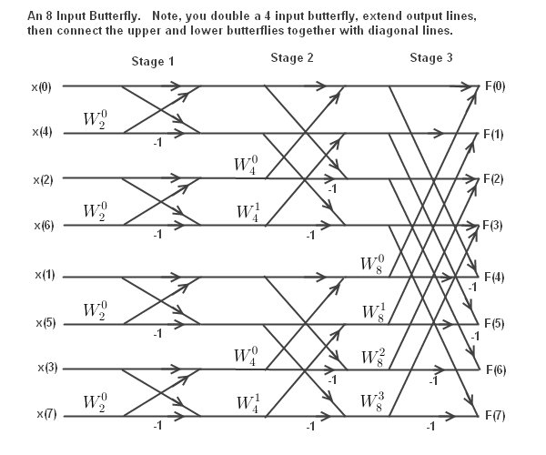

# JFFT
Yes really, a simpler FFT.

## Background

I didn't understand any of the Fast Fourier transforms (FFTs). This meant I had to use other people's FFTs and they were not as I wished them to be. I just wanted a simple FFT that I could modify as I wished and would also allow me to use the complex C++ object called `complex`. I wanted to have the ability to port the FFT code easily to an embedded system as well. Not having what I wanted started grinding my gears so I bit the bullet and learned how the radix 2 FFT worked thanks to http://www.alwayslearn.com/DFT%20and%20FFT%20Tutorial/DFTandFFT_BasicIdea.html . It actually is quite simple; it's just an expansion of the Fourier transform and rewriting it in an iterative form. The iterative form can be seen nicely in the butterfly flow graphs or whatever they called http://www.alwayslearn.com/DFT%20and%20FFT%20Tutorial/DFTandFFT_FFT_Butterfly_8_Input.html .



The twiddle factors that I have heard of and always thought they had a funny sounding name are actually just some of the roots of unity. The hour markings on an old-fashioned analog clock are an example of some roots of unity. You divide the circle into evenly spaced slices and use just the ones up to but not including halfway around the circle. The reason for not using all of them is because you can get the rest of them by multiplying them by -1. A nice picture of what is in my mind of them can be seen http://www.alwayslearn.com/DFT%20and%20FFT%20Tutorial/DFTandFFT_FFT_TwiddleFactor.html .


With the expansion of the Fourier transform all the indices get muddled up in what turns out to reverse all the bits of the indices. So the 0b001 (1) st sample becomes the 0b100 (4) th sample. This is not fun and in the end I just used and iterative flipping method to do it.

For an FFT there are the same number of input samples as there are output samples. In this implementation the transformation is in place meaning the input samples become the output samples after the transformation has been performed.

## Usage

Usage is simple and doesn't require any FFT initialization if using vectors/QVectors, just pass a populated vector to be transformed.

So...

Include the header file...

```
#include "jfft.h"
```

Create an instance...

```
    JFFT fft;
```

Load a vector with a couple of sine waves... 

```
    //load time data in this case two real sine waves
    QVector<JFFT::cpx_type> x;
    x.resize(16384);//use a power of 2 else JFFT will change it to be so
    for(int i=0;i<x.size();++i)
    {
        x[i]=JFFT::cpx_type(sin(((double)i)/2.0),0);
        x[i]+=JFFT::cpx_type(sin(((double)i)/4.6),0);
    }
```

Perform the FFT...

```
    //tranform it to the frequency domain
    fft.fft(x);
```

And you're done.

To perform an inverse FFT just use `fft.ifft(x);` .

I have put in a slow Fourier transform (called `sft`) using the definition of the Fourier transform for comparison. I have also put in an easier to understand FFT function called `fft_easy_to_understand` if you want to understand a bit of how the FFT works. The `fft_easy_to_understand` function is the same as the `fft` function but is somewhat slower and I find easier to understand. I created the `fft` function by modifying the `fft_easy_to_understand` function.

Only two files and needed to use JFFT `jfft.cpp` and `jfft.h`

I've also put in real FFT/IFFT that's about twice as fast as complex FFT/IFFT. Also there are real and complex Fast FIR filters with LPF,HPF and BPF designers. Speed wise this code is looking like it's a bit slower than KissFFT but that's to be expected as speed is not my intention but rather something that is easier to understand, use and modify if needed.

## FFT example code

Included in this repository is an example program written in QT C++. It performs a Fourier transform of two sine waves and outputs some text that can be cut and pasted into MATLAB or Octave to view the results. Doing this I generated the following figure.


The reason for four peaks is that the two peaks on the right are for negative frequencies; this happens when putting in a real sine wave into a complex Fourier transform. The Fourier transform has no way of knowing whether the sine wave is spinning clockwise or anticlockwise.

## FFT vs SFT

Speed wise compared to the slow Fourier transform there is no comparison as the following figure shows.


On my computer doing a quick test, the slow Fourier transform with 16,384 sample points took about 3000 times longer to perform than the FFT. FFT is the only way to go.

Having a look at the JFastFIR I see on the GitHub repository I recorded 20ms using a 48000 real sample signal with a 10001 point kernel with KissFFT, using JFFT I get about 25ms currently on the same computer.

Jonti


